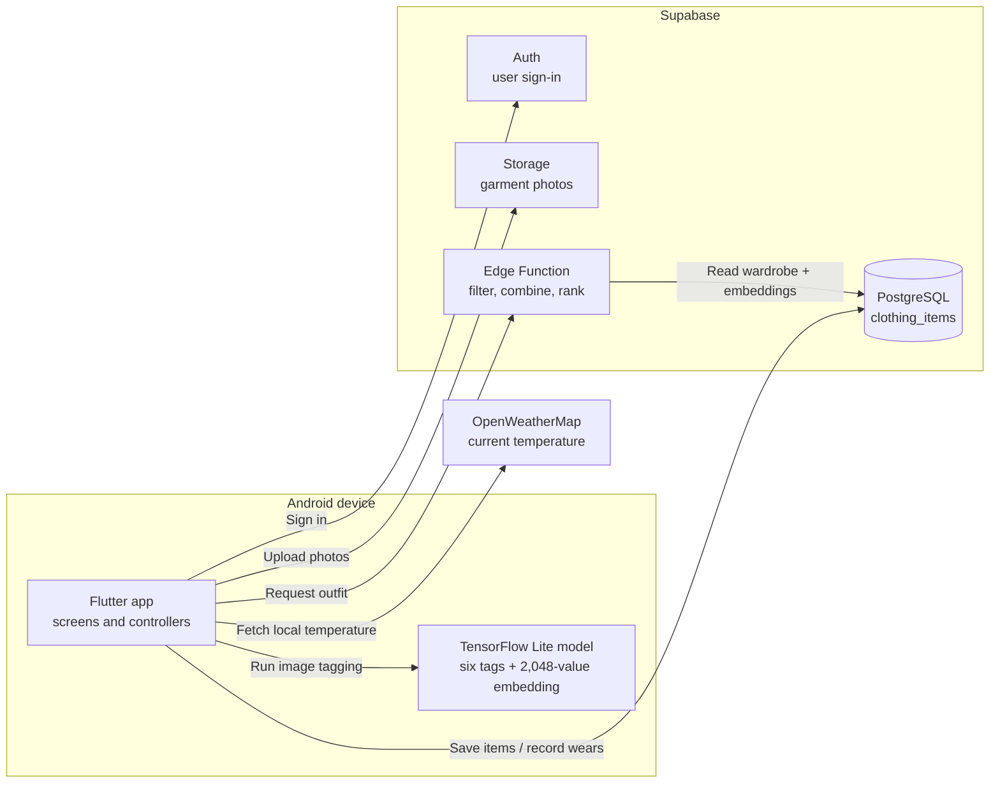
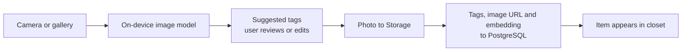
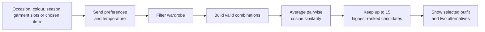
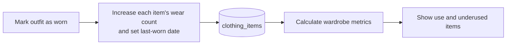

# AuraFit

**An Android wardrobe app that helps people use the clothes they already own.**

Final-year project · Built independently · Flutter, TensorFlow Lite, Supabase

| Add clothes | Plan an outfit | See what gets worn |
| --- | --- | --- |
| Photograph an item, review its suggested tags, and save it to a digital closet. | Choose an occasion and preferences, then get combinations from your own wardrobe. | Record wears and spot items that are getting little use. |

| Images in the model dataset | Attributes predicted | Embedding values per item |
| ---: | ---: | ---: |
| **43,917** | **6** | **2,048** |

## 01 · The app

| Home Screen | Upload & Classification | Outfit Recommendation |
| --- | --- | --- |
| 
 | 
 | 
 |

**Project goal:** Suggest outfits from clothes the user owns and make underused items visible. The sustainability feature encourages reuse through wear tracking; it does not calculate environmental impact.

## 02 · Architecture



| On the phone | In Supabase | External data |
| --- | --- | --- |
| Image tagging and the app interface | Accounts, photos, wardrobe records, and outfit ranking | Current temperature for a season rule |

## 03 · Three user flows

### A. Add a garment



- **Model output:** Gender, subcategory, article type, base colour, season, usage, and a visual embedding.
- **User control:** Review or correct suggested tags before saving.

### B. Build an outfit



- **Ranking:** The Edge Function scores complete outfit combinations using pairwise cosine similarity between garment embeddings.
- **Harmony Score:** Average similarity × 100, used to order the outfits.
- **Weather:** Current temperature supplies a season filter when the user has not chosen one. Colour or season filters can relax if the wardrobe is too limited.
- **Implementation:** No KNN model or PostgreSQL vector search runs in the deployed recommendation flow.

### C. Track wardrobe use



| Measure shown in the app | Calculation |
| --- | --- |
| Wardrobe reuse rate | Items worn at least once ÷ all saved items |
| Underused items | Items worn fewer than two times |
| Wears by category | Total recorded wears for each clothing category |
| Most-worn items | Ten items with the highest wear counts |

## 04 · Model and evaluation

| Model setup | Value |
| --- | --- |
| Dataset | 43,917 Fashion Product Images records after filtering |
| Split | 35,133 training / 8,784 validation images |
| Architecture | ImageNet-pretrained ResNet-50 fine-tuned with six attribute heads |
| Input | 299 × 299 image |
| App output | Six tags and a 2,048-value embedding, packaged as TensorFlow Lite |

**Validation accuracy:** For each attribute below, this is the share of validation photos whose predicted label matched the dataset label. For example, **93.57% subcategory accuracy** means the correct subcategory was predicted for about 94 of every 100 validation photos.

| Predicted attribute | Example labels | Correct on validation images |
| --- | --- | ---: |
| Subcategory | Topwear, Shoes | **93.57%** |
| Usage | Casual, Formal | **90.14%** |
| Gender | Men, Women | **89.33%** |
| Article type | Tshirts, Jeans | **81.32%** |
| Season | Summer, Winter | **72.22%** |
| Base colour | Black, Blue | **45.17%** |

The validation split was also used to choose model checkpoints. Colour is the least reliable tag; users can correct it before saving.

## 05 · Data and tools

| Component | What it stores or does |
| --- | --- |
| `clothing_items` table | User ID, image URL, tags, vector embedding, wear count, last-worn date, creation date |
| Supabase Storage | Garment photos in the public `clothing_items` bucket |
| Row-level policies | Users can view, insert, update, and delete their own item records |
| Outfit Edge Function | Reads the user's wardrobe and scores combinations in TypeScript |

- Embeddings are stored in a PostgreSQL `vector` column; the Edge Function calculates similarity after reading item records.
- Garment photo URLs are public; account ownership rules apply to wardrobe records.

**App:**  

**Model work:**    

**Backend and weather:**    

**Development:**  

## 06 · What I would improve next

| Area | Next step |
| --- | --- |
| Attribute model | Improve colour data and test on a separate, untouched image set |
| Outfit quality | Get user ratings and compare the ranking with simpler baselines |
| Recommendation flow | Make regeneration reproducible and handle single-piece outfits explicitly |
| Deployment | Move garment photos to private storage and add reproducible database migrations |

<details>
<summary>Run the source locally</summary>

The repository contains Flutter source, model assets, and Edge Function source. It does not include a prebuilt APK or database migration. A fresh setup needs a Supabase project with the matching table, bucket, policies, and deployed function, plus an OpenWeatherMap API key.

```bash
git clone https://github.com/heyitssyakirrr/stylemate.git
cd stylemate
flutter pub get
flutter run
```

For a different backend, set the Supabase URL and publishable key in `lib/main.dart` and the weather API key in `lib/services/weather_service.dart`. Configuration is currently in source.

</details>
