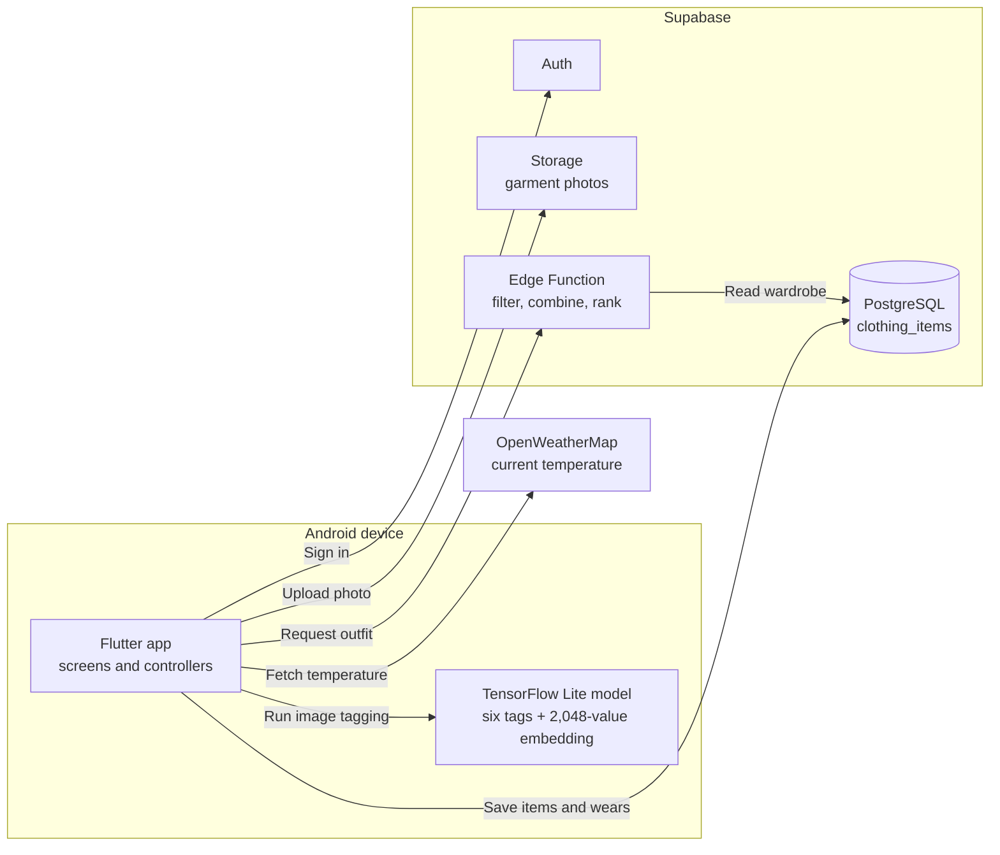
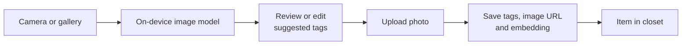
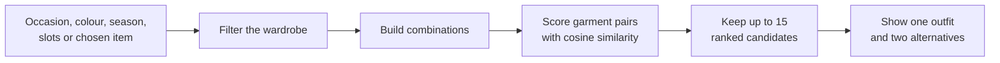
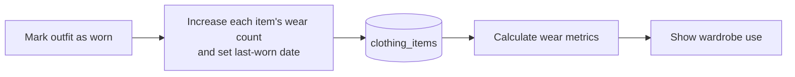

# AuraFit

**Final Year Project:**<br>
An Android app for organising a personal wardrobe. Users can add clothes with a photo, edit the suggested tags, get outfit recommendations from their saved items, and track how often they wear each piece.

---

## 01 · The app

| Home | Add an item | Outfit | Closet | Wear analytics |
| :---: | :---: | :---: | :---: | :---: |
|  |  |  | *Screenshot to add* | *Screenshot to add* |

<table>
  <tr>
    <th width="50%">Core features</th>
    <th width="50%">Target users</th>
  </tr>
  <tr>
    <td valign="top">
      <ul>
        <li>Add clothes with editable, model-suggested tags.</li>
        <li>Build outfits from items already in the closet.</li>
        <li>Record wears and see underused items.</li>
      </ul>
    </td>
    <td valign="top">
      <ul>
        <li>Busy professionals looking for quicker outfit decisions.</li>
        <li>People who enjoy styling the clothes they own.</li>
        <li>People who want to make better use of their wardrobe.</li>
      </ul>
    </td>
  </tr>
</table>

---

## 02 · Architecture



- **On the phone:** The Flutter app runs the TensorFlow Lite model when a garment is added.
- **In Supabase:** Auth handles sign-in; Storage keeps photos; PostgreSQL keeps item records; the Edge Function ranks outfits.
- **Weather:** OpenWeatherMap supplies the current temperature when location access is available.

---

## 03 · Main flows

### 📷 Add a garment



The model suggests **gender, subcategory, article type, base colour, season, and usage**. It also produces a visual embedding used by the outfit ranker. Tags remain editable before saving.

### 👕 Build an outfit



- **Harmony Score:** Average pairwise cosine similarity × 100. It ranks outfits; it is not a probability.
- **Weather rule:** If no season is chosen, current temperature can supply one. Colour or season filters can relax when few items match.
- **Method:** The deployed function scores outfit combinations in TypeScript. It does not use KNN or a PostgreSQL vector-search query.

### ♻️ Track wardrobe use



- **Reuse rate:** Items worn at least once ÷ all saved items.
- **Underused:** Number of items worn fewer than two times.
- **Other views:** Total wears by category and the ten most-worn items.

These numbers help people notice clothes they could wear again. They are not measurements of waste or environmental impact.

---

## 04 · Model and validation

<table>
  <tr>
    <td width="50%" valign="top">
      <strong>Model setup</strong>
      <table width="100%">
        <tr><th>Part</th><th>Details</th></tr>
        <tr><td>Dataset</td><td>43,917 filtered images</td></tr>
        <tr><td>Split</td><td>35,133 train / 8,784 validation</td></tr>
        <tr><td>Backbone</td><td>ImageNet-pretrained ResNet-50</td></tr>
        <tr><td>Training</td><td>Fine-tuned with six attribute heads</td></tr>
        <tr><td>Input</td><td>299 × 299 image</td></tr>
        <tr><td>In the app</td><td>TensorFlow Lite; six tags and a 2,048-value embedding</td></tr>
      </table>
      <p>I trained the model on the Fashion Product Images dataset and converted it to TensorFlow Lite for Android. The embedding is saved with each item for outfit ranking. Suggested tags can be corrected before saving.</p>
    </td>
    <td width="50%" valign="top">
      <strong>Validation accuracy</strong>
      <table width="100%">
        <tr><th>Attribute</th><th>Example label</th><th>Correct</th></tr>
        <tr><td>Subcategory</td><td>Topwear</td><td>93.57%</td></tr>
        <tr><td>Usage</td><td>Casual</td><td>90.14%</td></tr>
        <tr><td>Gender</td><td>Women</td><td>89.33%</td></tr>
        <tr><td>Article type</td><td>Tshirts</td><td>81.32%</td></tr>
        <tr><td>Season</td><td>Summer</td><td>72.22%</td></tr>
        <tr><td>Base colour</td><td>Black</td><td>45.17%</td></tr>
      </table>
      <p>Each number is the share of 8,784 validation photos where that attribute matched the dataset label. For subcategory, 93.57% means roughly 94 of every 100 photos got the correct subcategory. Base colour was the weakest result.</p>
    </td>
  </tr>
</table>

The same validation split was also used to choose model checkpoints. A separate, untouched test set would give a stronger final evaluation.

---

## 05 · Data and tools

### Where the data lives

- **PostgreSQL:** The `clothing_items` table stores each user's item, image URL, tags, embedding, wear count, and dates. The embedding uses a `vector` column.
- **Supabase Storage:** Garment photos are in the public `clothing_items` bucket, so anyone with a photo URL can view it.
- **Access rules:** Row-level policies let users view, add, edit, and delete their own item records.
- **Edge Function:** Reads wardrobe records, applies filters, scores combinations, and returns a selected outfit with alternatives. Similarity is calculated here, after reading the vectors.

### Tools used

**Android app**

 

**Model work**

   

**Backend and weather**

   

**Development**

 

---

## 06 · What I would improve

- Improve base-colour classification and evaluate the model on a separate test set.
- Ask users to rate outfit suggestions, then compare this ranking with simpler approaches.
- Make regeneration reproducible and give single-piece outfits a meaningful score.
- Use private photo storage and include database migrations for a fresh setup.

<details>
<summary>Run the source locally</summary>

The repository contains the Flutter source, model assets, and Edge Function source. It does not include a prebuilt APK or database migration. A fresh setup needs a matching Supabase table, bucket, policies, deployed function, and an OpenWeatherMap API key.

```bash
git clone https://github.com/heyitssyakirrr/stylemate.git
cd stylemate
flutter pub get
flutter run
```

For a different backend, set the Supabase URL and publishable key in `lib/main.dart` and the weather API key in `lib/services/weather_service.dart`. Configuration is currently in source.

</details>
