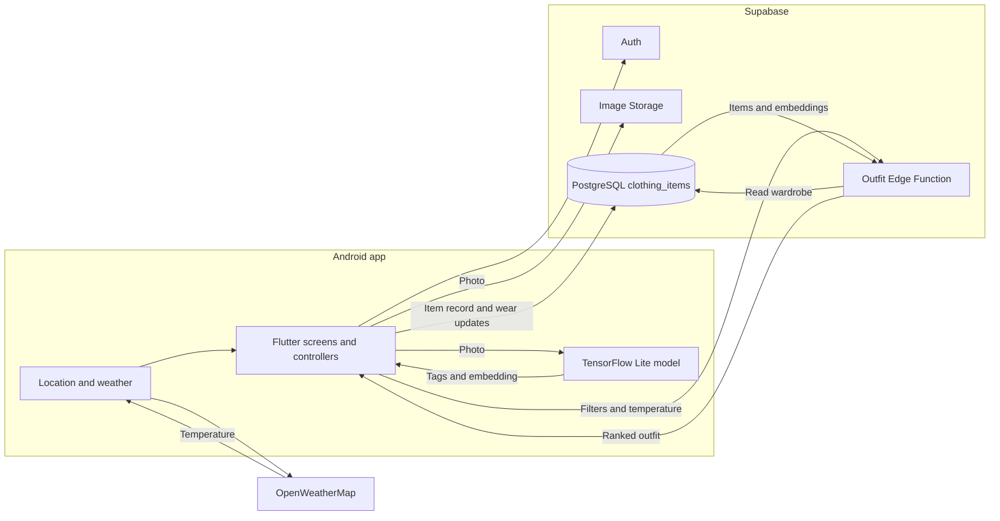
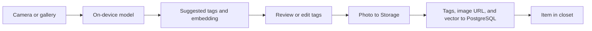
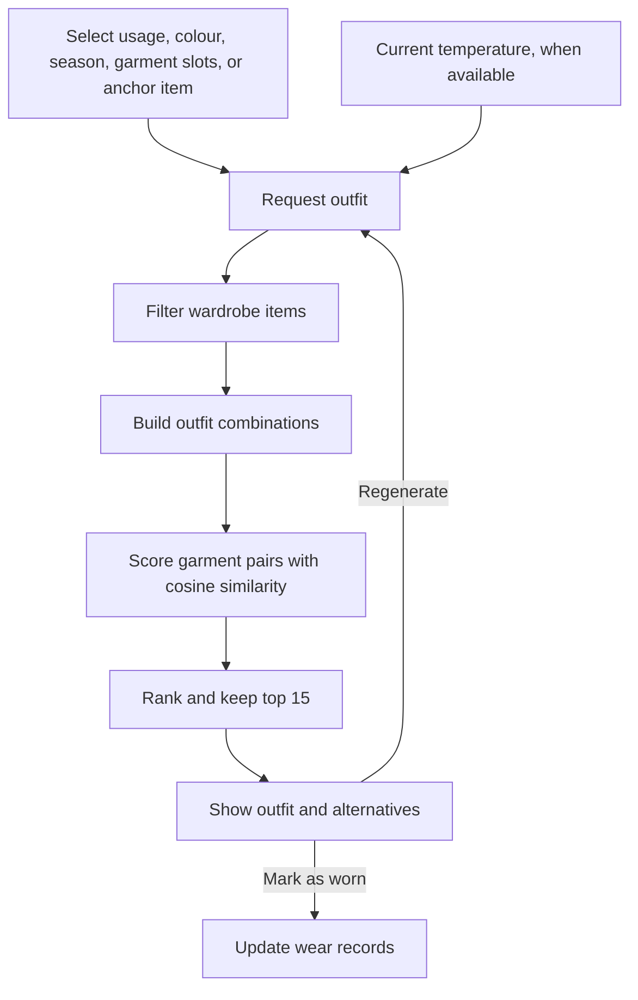
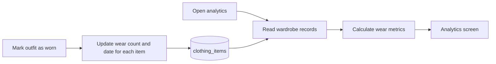

# AuraFit

**An Android wardrobe app built for my final-year project.**

Photograph a garment, check its suggested tags, build an outfit from your own clothes, and track what you wear. I built the mobile app, model pipeline, Supabase integration, and recommendation logic.

## What the app does

| 1. Digitise a closet | 2. Suggest an outfit | 3. Track wardrobe use |
| --- | --- | --- |
| On-device image tagging, with tags the user can correct. | Outfit options from the user's own clothes, with occasion, colour, garment, and weather context. | Wear counts and a view of clothes that are rarely used. |

### App screens

| Closet and editable tags | Outfit result | Wear analytics |
| --- | --- | --- |
| *Screenshot to add* | *Screenshot to add* | *Screenshot to add* |

## Tools used

**Android app:**  

**Model training and image preparation:**    

**Backend and integrations:**    

**Development:**  

## Architecture

The model runs **on the phone**. The recommendation logic runs in a **Supabase Edge Function**. PostgreSQL stores the garment records and embeddings; the function calculates similarity after reading those records.



## User flows

### 1. Add a garment



The model predicts **gender, subcategory, article type, base colour, season, and usage**. During upload, the app maps the predicted article type to a broader closet category such as Topwear or Footwear. The user can change the displayed tags before saving.

### 2. Generate an outfit



- **Context:** Usage, colour, season, garment slots, and an optional item the outfit must include. If no season is chosen, temperature supplies one when weather is available.
- **Ranking:** Harmony score = average pairwise cosine similarity between garment embeddings, multiplied by 100 for display.
- **Method:** The deployed app ranks whole outfits. It does not run KNN or a PostgreSQL vector-search query. The score is a ranking aid, not a probability of a good match.

### 3. See what gets worn



| Metric | How it is calculated |
| --- | --- |
| Wardrobe reuse rate | Items worn at least once ÷ total items. |
| Underused items | Number of items worn fewer than two times. |
| Wear by category | Total wears for each garment category. |
| Most-worn items | Ten items with the highest wear counts. |

These measures show wardrobe use. They do not measure waste or environmental impact.

## Model and results

| | |
| --- | --- |
| Training data | **43,917** matched images from the Fashion Product Images dataset, after filtering rare article types. |
| Model | ImageNet-pretrained **ResNet-50**, then fine-tuned for clothing attributes. |
| Input | **299 × 299** garment image. |
| Outputs | Six clothing tags and a **2,048-value** visual embedding. |
| Mobile format | TensorFlow Lite, packaged with the Android app. |

**Attribute accuracy** on the project's 20% validation split:

| Subcategory | Usage | Gender | Article type | Season | Base colour |
| ---: | ---: | ---: | ---: | ---: | ---: |
| **93.57%** | 90.14% | 89.33% | 81.32% | 72.22% | 45.17% |

There is no single “93% app accuracy”: each figure measures a different tag. Colour is the weakest result, so tag editing matters. This split was also used to choose model checkpoints; a future evaluation should use a separate, untouched test set.

## Data and services

| Service | What AuraFit uses it for |
| --- | --- |
| Supabase Auth | Sign-in and user identity. Row-level policies restrict item records to their owner. |
| Supabase Storage | Garment photos in a public `clothing_items` bucket. Anyone with an image URL can view that image. |
| PostgreSQL | `clothing_items`: owner, image URL, tags, `vector` embedding, wear count, last-worn date, and creation date. |
| Supabase Edge Function | Reads the user's closet, applies outfit rules, scores combinations, and returns ranked results. |
| OpenWeatherMap | Current temperature from the device's location; used for a season rule when no season is selected. |

The embedding is stored as a PostgreSQL `vector`. Similarity is calculated in the Edge Function, not by a database vector index.

## Current limits

- **Model:** Base-colour accuracy is 45.17%; users should check suggested tags.
- **Styling:** The model learns garment attributes, not human judgments of outfit quality. Cosine similarity is a heuristic.
- **Weather:** The rule uses temperature, not rain, wind, or a forecast. Limited wardrobes may trigger relaxed season or colour filters.
- **Recommendation flow:** Regeneration reshuffles candidate pools, so results are not a stable sequence. A single-piece outfit has no pair to compare and currently scores zero.
- **Evaluation and privacy:** The validation split was reused for reporting, and garment images have public URLs. Both need review before wider deployment.

## Running the source

The repository has the Flutter source, model assets, and Edge Function source. It does **not** include a database migration or a prebuilt APK. A new installation needs a matching Supabase table, Storage bucket, access policies, deployed Edge Function, and OpenWeatherMap API key.

```bash
git clone https://github.com/heyitssyakirrr/stylemate.git
cd stylemate
flutter pub get
flutter run
```

For a different backend, update the Supabase URL and publishable key in `lib/main.dart` and the weather API key in `lib/services/weather_service.dart`. Configuration is currently in source; moving it out of source is part of preparing the app for wider use.
